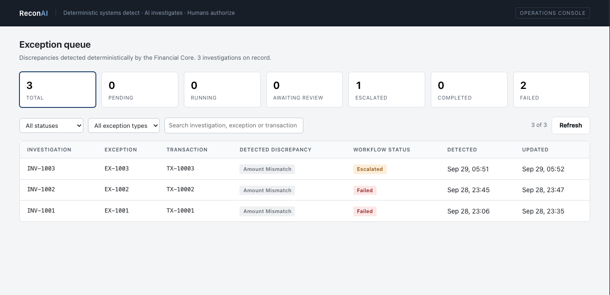
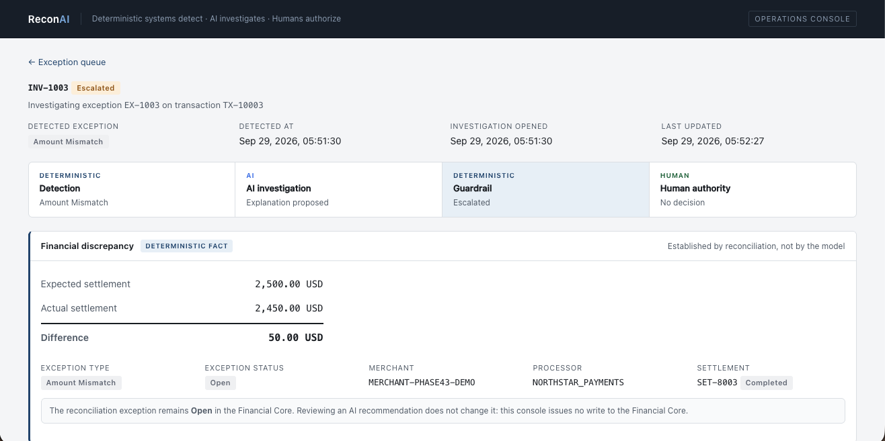
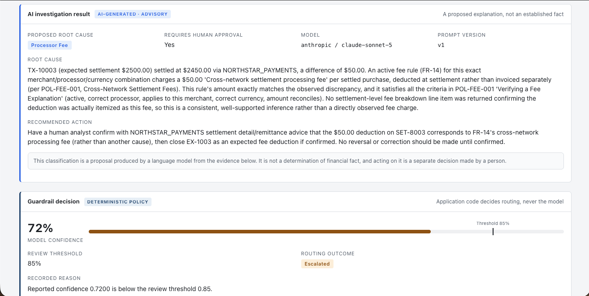
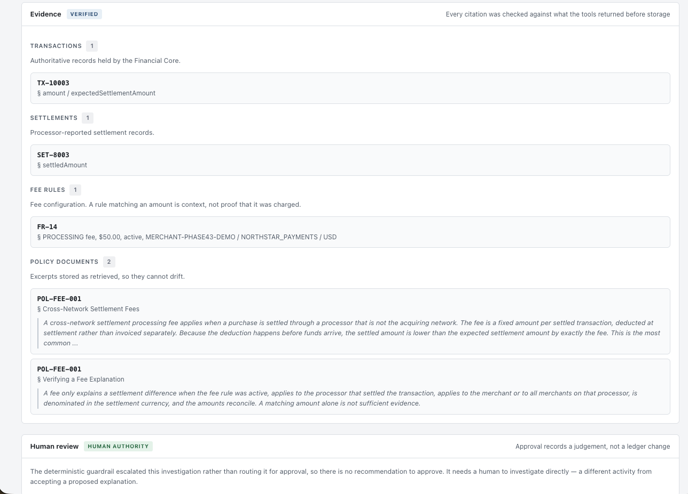
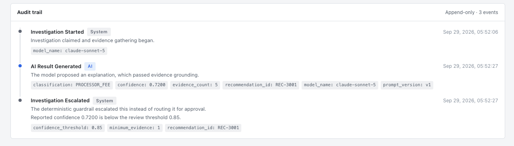

# ReconAI

> **Deterministic systems detect. AI investigates. Humans authorize.**

ReconAI is an event-driven payment reconciliation and exception-investigation platform built around one principle: **AI can investigate financial discrepancies, but it should not decide financial truth or mutate authoritative records.**

A Java/Spring Boot financial core deterministically compares transactions and settlements. When it detects a discrepancy, Kafka asynchronously triggers a Python/FastAPI investigation service. The investigation agent gathers evidence through a small set of controlled, read-only tools, produces a grounded recommendation, and passes the result through deterministic guardrails before a human reviews it.

**Live Demo:** https://reconai.pragatinarote.com

---

## Why ReconAI?

Traditional reconciliation rules are good at answering:

> **Do these authoritative records agree?**

They are less suited to answering:

> **Why don't they agree?**

ReconAI deliberately separates those questions.

```text
DETECTION                     INVESTIGATION                    DECISION

Transaction ─┐
             ├─▶ Deterministic ─▶ Exception ─▶ Kafka ─▶ AI Investigation
Settlement ──┘   Reconciliation                         │
                                                         ├─ Transaction evidence
                                                         ├─ Settlement evidence
                                                         ├─ Fee rules
                                                         └─ Policy documents
                                                                │
                                                                ▼
                                                        Grounded Result
                                                                │
                                                                ▼
                                                   Deterministic Guardrail
                                                        │             │
                                                        ▼             ▼
                                                Awaiting Review    Escalated
                                                        │
                                                        ▼
                                                     Human
```

The LLM never determines whether two financial records reconcile. It investigates an exception that the deterministic system has already established.

---

## A Real Investigation

One deployed scenario demonstrates the intended behavior:

```text
Expected settlement       $2,500.00
Observed settlement       $2,450.00
Difference                   $50.00
                              │
                              ▼
Deterministic detection   AMOUNT_MISMATCH
                              │
                              ▼
Kafka event               reconciliation.exceptions
                              │
                              ▼
AI investigation          PROCESSOR_FEE
                              │
                              ├─ transaction evidence
                              ├─ settlement evidence
                              ├─ matching $50 fee rule
                              └─ applicable policy evidence
                              │
                              ▼
Model confidence              72%
Review threshold              85%
                              │
                              ▼
Guardrail                  ESCALATED
                              │
                              ▼
Human review required
```

The important outcome is not that the model found a plausible $50 fee.

It is that the system **refused to automatically trust a plausible explanation**.

The investigation found evidence consistent with a processor fee, but the available settlement data did not directly prove that the deduction was caused by that fee. The model therefore returned a lower confidence result, and deterministic application code escalated it for human review.

---

### Deployed Demo

The deployed console makes the separation between deterministic detection, AI investigation, deterministic policy, and human authority visible throughout the workflow.

#### Operations Dashboard



#### Investigation Detail

The Financial Core establishes the discrepancy independently of the model: an expected `$2,500` settlement arrived as `$2,450`, producing a deterministic `$50` `AMOUNT_MISMATCH`.



#### AI Recommendation & Deterministic Guardrail

The investigation proposes `PROCESSOR_FEE` after grounding its explanation in the transaction, settlement, fee rule, and applicable policy evidence. The model returns **72% confidence**, below the deterministic **85% review threshold**, so application code routes the investigation to `ESCALATED` rather than allowing it to proceed toward approval.



#### Verified Evidence

Every cited identifier is checked against evidence actually returned by controlled tools. The analyst can inspect the transaction, settlement, matching fee rule, and policy excerpts before acting on the recommendation.



#### Append-Only Audit Trail

The investigation lifecycle is recorded independently of the model output, including when investigation began, when the AI result was generated, and why the deterministic guardrail escalated the case.


---

## Architecture

### Application

```text
                         ┌──────────────────────┐
                         │   React + TypeScript │
                         │ Operations Console   │
                         └──────────┬───────────┘
                                    │
                              REST APIs
                                    │
                         ┌──────────▼───────────┐
                         │ Java 21 / Spring Boot│
                         │    Financial Core    │
                         └──────────┬───────────┘
                                    │
                 ┌──────────────────┼───────────────────┐
                 │                  │                   │
                 ▼                  ▼                   ▼
           Transactions        Settlements       Reconciliation
                                                        │
                                                 Exception detected
                                                        │
                                                        ▼
                                                      Kafka
                                          reconciliation.exceptions
                                                        │
                                                        ▼
                                           ┌────────────────────────┐
                                           │ Python 3.12 / FastAPI  │
                                           │ Investigation Service  │
                                           └────────────┬───────────┘
                                                        │
                                  ┌─────────────────────┼─────────────────────┐
                                  ▼                     ▼                     ▼
                           Financial Evidence      Fee Rules          Policy Search
                                  │                     │                     │
                                  └─────────────────────┼─────────────────────┘
                                                        │
                                                        ▼
                                                Evidence Ledger
                                                        │
                                                        ▼
                                               Structured AI Result
                                                        │
                                                        ▼
                                           Deterministic Guardrail
                                                        │
                                                        ▼
                                                  Human Review
                                                        │
                                                        ▼
                                               Append-only Audit
```

### AWS deployment

```text
Browser
   │
   ▼
CloudFront
   ├──────────────▶ S3
   │                React frontend
   │
   ▼
Application Load Balancer
   │
   ├──────────────▶ ECS Fargate — Financial Core
   │
   └──────────────▶ ECS Fargate — Investigation Service
                         │
                         ├── Kafka
                         └── Anthropic API

Application services ─────────▶ RDS PostgreSQL

Container images ─────────────▶ Amazon ECR
Logs ─────────────────────────▶ CloudWatch
Infrastructure ───────────────▶ Terraform
```

The portfolio deployment intentionally favors a compact demo architecture over production-scale infrastructure.

---

## Deterministic Financial Core

**Java 21 · Spring Boot 3 · PostgreSQL · Flyway**

The Financial Core is authoritative for transactions, settlements, fee rules, and reconciliation exceptions.

V1 detects four discrepancy types:

```text
AMOUNT_MISMATCH
MISSING_SETTLEMENT
DUPLICATE_SETTLEMENT
CURRENCY_MISMATCH
```

`PROCESSOR_FEE` is deliberately **not** a deterministic exception type.

A `$50` settlement difference remains an `AMOUNT_MISMATCH` even if a `$50` fee rule exists. A fee is a possible **cause** of the mismatch, not proof that the records reconcile.

That distinction keeps financial comparison deterministic while allowing the investigation layer to reason about possible causes.

---

## Event-Driven Investigation

AI investigation is asynchronous because model calls have different latency, cost, and failure characteristics from financial reconciliation.

When a new exception is committed:

```text
ReconciliationException persisted
              │
              ▼
     AFTER_COMMIT event
              │
              ▼
Kafka: reconciliation.exceptions
              │
              ▼
Investigation Service
              │
              ▼
        PENDING case
```

Publishing happens **after the database transaction commits**, preventing investigation of an exception that later rolls back.

The event contains only the identity needed to begin investigation:

```json
{
  "exceptionId": "EX-1003",
  "transactionId": "TX-10003",
  "type": "AMOUNT_MISMATCH",
  "detectedAt": "2026-09-29T..."
}
```

Amounts, merchant information, settlements, and other authoritative data are not copied into the event. The investigation service retrieves current evidence through controlled APIs instead.

---

## Controlled AI Investigation

The investigation service does not give the model SQL access, filesystem access, arbitrary HTTP access, or code execution.

The model can request only registered tools:

| Tool | Purpose |
|---|---|
| `get_transaction` | Retrieve the authoritative transaction |
| `get_settlements` | Retrieve settlement records for the transaction |
| `get_fee_rules` | Retrieve applicable processor/merchant fee rules |
| `search_policy_documents` | Search the synthetic policy corpus |

Financial tools are **read-only**.

The investigation service does not connect to the Financial Core's tables and cannot modify transactions, settlements, exceptions, or balances.

The agent loop is also bounded. If the model cannot reach a valid result within the configured tool-round limit, the investigation fails visibly rather than continuing indefinitely.

---

## Evidence Grounding

ReconAI does not trust the model to tell the application whether its citations are real.

During an investigation, every record returned by a controlled tool is added to an application-owned **evidence ledger**.

When the model produces its final result:

```text
Model citation
     │
     ▼
Was this identifier actually returned
by a tool during this investigation?
     │
  ┌──┴──┐
 YES    NO
  │      │
  ▼      ▼
accept  reject result
```

A fabricated-but-plausible reference such as `FR-999` cannot become evidence simply because the model generated it.

If a material conclusion cannot be supported, the system supports:

```text
INSUFFICIENT_EVIDENCE
```

as a valid outcome rather than encouraging the model to guess.

Policy retrieval in V1 uses deterministic lexical matching over a small synthetic Markdown corpus. Embeddings and a vector database are intentionally not required for the current scope.

---

## Deterministic Guardrails

The model proposes an investigation result.

**Application code decides where it goes next.**

Current routing policy:

```text
INSUFFICIENT_EVIDENCE / UNKNOWN
        │
        └────────────▶ ESCALATED

Insufficient verified evidence
        │
        └────────────▶ ESCALATED

confidence < 0.85
        │
        └────────────▶ ESCALATED

otherwise
        │
        └────────────▶ AWAITING_REVIEW
```

The confidence value is treated as a model-provided signal, **not a calibrated probability**.

The threshold is an operational policy. It does not mean that `0.85` represents an 85% statistical probability of correctness.

---

## Human-in-the-Loop by Construction

Investigation lifecycle:

```text
PENDING
   │
   ▼
RUNNING
   │
   ├──────── grounded + threshold satisfied ───────▶ AWAITING_REVIEW
   │                                                    │
   │                                                    ├─ approve ─▶ COMPLETED
   │                                                    ├─ reject ──▶ ESCALATED
   │                                                    └─ escalate ▶ ESCALATED
   │
   ├──────── guardrail rejects result ─────────────▶ ESCALATED
   │
   └──────── execution failure ────────────────────▶ FAILED
```

**Only a human can move an investigation to `COMPLETED`.**

Even approval does not change a transaction, settlement, ledger balance, or reconciliation exception. It records that a human accepted the proposed explanation.

Financial mutation is outside the investigation service's capabilities.

---

## Auditability

ReconAI maintains an append-only investigation audit trail.

Examples include:

```text
INVESTIGATION_CREATED
INVESTIGATION_STARTED
AI_RESULT_GENERATED
INVESTIGATION_AWAITING_REVIEW
INVESTIGATION_ESCALATED
INVESTIGATION_FAILED
REVIEW_APPROVED
REVIEW_REJECTED
```

Audit events record the lifecycle and actor type without storing prompts, credentials, provider responses, or private model reasoning.

State transitions and their corresponding audit records are committed together.

---

## Failure Isolation

A core design requirement is:

> **AI failure must not become financial-system failure.**

If the LLM provider is unavailable:

```text
Reconciliation        ✓ continues
Exception detection   ✓ continues
Financial records     ✓ remain authoritative
AI investigation      ✗ temporarily unavailable
```

Kafka decouples exception detection from investigation so variable model latency does not sit on the financial reconciliation path.

V1 intentionally documents remaining production-hardening work, including a transactional outbox for stronger database/Kafka delivery guarantees and dead-letter handling for poison messages.

---

## Operations Console

The React operations console exposes the workflow an analyst actually needs:

- reconciliation health and exception counts;
- exception queue and status filtering;
- transaction and settlement discrepancy details;
- AI-proposed root cause;
- model confidence and deterministic review threshold;
- guardrail outcome;
- retrieved evidence;
- recommended human action; and
- append-only audit history.

The UI explicitly labels AI output as **advisory** and separates it from deterministic policy decisions and human authority.

---

## CI/CD

### Continuous Integration

Every push or pull request to `main` validates the major system boundaries independently:

```text
Backend
  └── Java 21 + Maven tests

Investigation Service
  └── Python 3.12 + pytest

Frontend
  └── Node 22 + tests + production build

Containers
  └── Financial Core Docker build
  └── Investigation Service Docker build

Infrastructure
  └── terraform fmt
  └── terraform validate
```

### Deployment

The demo deployment is intentionally manual through GitHub Actions.

```text
GitHub Actions
      │
      ▼
GitHub OIDC
      │
      ▼
Temporary AWS credentials
      │
      ├────────▶ Build containers
      │                │
      │                ▼
      │         ECR :<git-sha>
      │                │
      │                ▼
      │         ECS task revision
      │
      └────────▶ React build
                       │
                       ▼
                       S3
                       │
                       ▼
                CloudFront invalidation
```

No long-lived AWS access key is stored in GitHub.

Application images are tagged with the immutable Git commit SHA, and deployments register new ECS task-definition revisions rather than relying on an ambiguous mutable image version.

---

## Infrastructure as Code

AWS infrastructure is managed with Terraform under [`infra/`](infra/).

The demo environment includes:

- VPC networking;
- Application Load Balancer;
- ECS Fargate;
- Amazon ECR;
- RDS PostgreSQL;
- S3;
- CloudFront;
- ACM;
- CloudWatch;
- AWS Systems Manager Parameter Store;
- IAM roles; and
- GitHub Actions OIDC federation.

The deployment intentionally makes several portfolio/demo tradeoffs that are documented in [`infra/README.md`](infra/README.md) rather than presenting them as production defaults.

---

## Local Development

### Prerequisite

Docker with Compose v2.

No local Java, Python, Node, PostgreSQL, or Kafka installation is required to run the complete stack.

### Start

```bash
docker compose up --build
```

### Services

| Service | Local URL |
|---|---|
| Operations Console | `http://localhost:3000` |
| Financial Core | `http://localhost:8099` |
| Investigation Service | `http://localhost:8000` |
| Investigation health | `http://localhost:8000/health` |
| Investigation readiness | `http://localhost:8000/ready` |
| PostgreSQL | `localhost:55432` |
| Kafka | `localhost:9092` |

Inside the Compose network:

```text
postgres:5432
kafka:29092
financial-core:8080
investigation-service:8000
```

### Optional live AI provider

The stack can run without an LLM provider. All services start normally, and deterministic reconciliation, persistence, messaging, and investigation intake remain available; only execution of a live AI investigation requires a configured provider.

```bash
cp .env.example .env
```

Configure the provider values in `.env`.

`.env` is gitignored and must never be committed.

> Running a live investigation can incur model-provider charges.

### Logs

```bash
docker compose logs -f
```

or:

```bash
docker compose logs -f investigation-service
```

### Stop without deleting data

```bash
docker compose down
```

Do **not** use `docker compose down -v` unless you intentionally want to delete the PostgreSQL volume and all local ReconAI data.

---

## Tech Stack

| Layer | Technology |
|---|---|
| Financial Core | Java 21, Spring Boot 3, JPA/Hibernate |
| Investigation Service | Python 3.12, FastAPI, Pydantic |
| AI Provider | Anthropic |
| Frontend | React, TypeScript, Vite |
| Messaging | Apache Kafka |
| Database | PostgreSQL 16 |
| Migrations | Flyway + Alembic |
| Containers | Docker, Docker Compose |
| Cloud | AWS ECS Fargate, RDS, ECR, S3, CloudFront, ALB, CloudWatch |
| Infrastructure | Terraform |
| CI/CD | GitHub Actions + AWS OIDC |

---

## Repository Structure

```text
ReconAI/
├── backend/                 # Spring Boot deterministic financial core
├── agent-service/           # FastAPI investigation service
├── frontend/                # React operations console
├── policies/                # Synthetic policy corpus
├── infra/                   # Terraform AWS infrastructure
├── docs/
│   ├── architecture.md
│   ├── api-contract.md
│   ├── data-model.md
│   └── problem-statement.md
├── .github/workflows/
│   ├── ci.yml
│   └── deploy.yml
└── docker-compose.yml
```

---

## Design Decisions

A few decisions are intentionally conservative:

**Deterministic detection, probabilistic investigation**  
An LLM never determines whether authoritative financial records agree.

**Read-only AI capabilities**  
The agent cannot modify financial records or approve its own recommendation.

**Evidence verified by application code**  
A citation is accepted only if a controlled tool actually returned it during that run.

**Asynchronous investigation**  
Financial reconciliation does not wait on model latency or availability.

**Human completion authority**  
No model confidence value can move an investigation to `COMPLETED`.

**Explicit failure over fabricated certainty**  
`INSUFFICIENT_EVIDENCE` and `FAILED` are preferable to an unsupported explanation.

**Documented V1 limitations**  
The project does not pretend demo infrastructure, self-reported confidence, lexical retrieval, or non-atomic database/Kafka publication are production-complete solutions.

---

## Documentation

For deeper implementation details:

- [`docs/architecture.md`](docs/architecture.md) — architecture and design decisions
- [`docs/data-model.md`](docs/data-model.md) — persistence model and ownership boundaries
- [`docs/api-contract.md`](docs/api-contract.md) — API contracts
- [`docs/problem-statement.md`](docs/problem-statement.md) — problem definition and scope
- [`agent-service/README.md`](agent-service/README.md) — investigation lifecycle, Kafka semantics, evidence tools and guardrails
- [`infra/README.md`](infra/README.md) — AWS architecture, deployment stages and infrastructure tradeoffs

---

## Scope

ReconAI is a portfolio/reference implementation built with synthetic financial data and policies.

It demonstrates how deterministic financial workflows and LLM-assisted investigation can coexist without giving a probabilistic model authority over financial truth.

The central boundary remains:

> **Deterministic systems detect. AI investigates. Humans authorize.**
